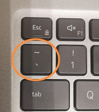
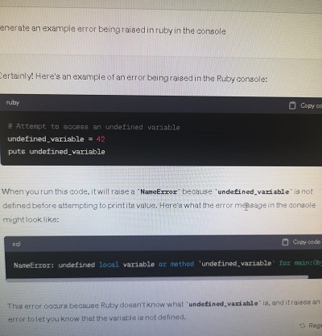
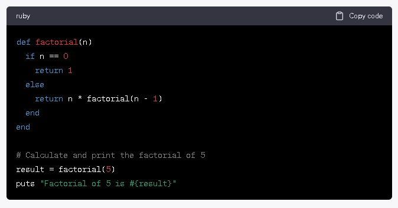
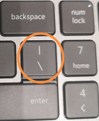

# github-docs-example

# Documentation about the Terraform Bootcamp

## Step 1 - Using Codeblocks


| Style |	Syntax | Keyboard Shortcut | Example | Output |
| ----- | ------ | ----------------- | ------- | ------ |
| Bold | `** ** or __ __` |	Command+B (Mac) or Ctrl+B (Windows/Linux) |	`**This is bold text**` | **This is bold text** |
| Italic | `* * or _ _` |	Command+I (Mac) or Ctrl+I (Windows/Linux) |	`_This text is italicized_` | _This text is italicized_ |

Codeblocks in markdown make it *very easy* for technical and non-technical people to **copy, paste, share** code. A good **Cloud Engineer** uses Codeblocks whenever possible.

This saves you time if you are a programmer by using code that has already been created. Additionally, by observing **how peers have resolved a particular problem**, Codeblocks are a terrific method to learn about and utilize current best practices.

Codeblocks are also excellent resources for **understanding how the code functions** if you are familiar with but not very adept with a language. Additionally, if you lack technical expertise, you may avoid the need to ask a technical resource to develop code for you.

Because it allows others to copy and paste their code to replicate or research issues.

- In order to create Codeblocks **in markdown you need to use three backticks (`)**

- **Not to be confused with quotation (')**

```
def factorial(n)
  if n == 0
    return 1
  else
    return n * factorial(n - 1)
  end
end

# Calculate and print the factorial of 5
result = factorial(5)
puts "Factorial of 5 is #{result}"
```

- When you can you should attempt to apply syntax highlighting to your Codeblocks

```ruby
def factorial(n)
  if n == 0
    return 1
  else
    return n * factorial(n - 1)
  end
end

# Calculate and print the factorial of 5
result = factorial(5)
puts "Factorial of 5 is #{result}"
```

**Send code in this format**

- Make note of where the backtick keyboard key is located.
- It should appear above the tab key,
- but it may vary based on your keyboard layout.

<!-- This content will not appear in the rendered Markdown

-->




Good Cloud Engineers use Codeblocks for both Code and Errors that appear in the console.

```bash
# Attempt to access an undefined variable
undefined_variable = 42
puts undefined_variable
```

Text that is not a quote

> Text that is a quote

> Here is an example of using a Codeblock for an error that appears in bash.

When you can always provide a Codeblock instead of a screenshot. If you need to take a screenshot make sure it is not a photo from your phone.

> There are certain cases where it is okay to take photos with your phone. This is when you are showing something like a keyboard, which does not appear on a computer screen. If it renders on your computer screen it should be a screenshot.

## Step 2 - How to take screenshots

A screenshot is when you capture a part of your screen from your laptop, desktop or phone.

This is not be confused with taking a photo with your phone.

**DO NOT DO THIS**



This is what a screenshot from your computer should look like

**DO THIS INSTEAD**



Screenshot example

To take screenshots on both macOS and Windows, you can use the following hotkeys:

You can take screenshots on both macOS and Windows using hotkeys or keyboard shortcuts. Here are the common methods for taking screenshots on each platform:

**On macOS:**

1. **Capture the Entire Screen:**
   - Press `Command (⌘) + Shift + 3`.
   - The screenshot will be saved to your desktop by default.

2. **Capture a Selected Portion of the Screen:**
   - Press `Command (⌘) + Shift + 4`.
   - Drag to select the area of the screen you want to capture.
   - Release the mouse button to take the screenshot.
   - The screenshot will be saved to your desktop by default.

3. **Capture a Specific Window:**
   - Press `Command (⌘) + Shift + 4`.
   - Press the `Spacebar`.
   - Click on the window you want to capture.
   - The screenshot of the selected window will be saved to your desktop by default.

**On Windows:**

1. **Capture the Entire Screen:**
   - Press `PrtScn` (Print Screen) key.
   - The screenshot is copied to the clipboard. You can paste it into an image editor (e.g., Paint, Photoshop) and save it from there.

2. **Capture the Active Window:**
   - Press `Alt + PrtScn`.
   - The screenshot of the currently active window is copied to the clipboard.

3. **Capture a Selected Portion of the Screen (Windows 10 and later):**
   - Press `Shift + Windows Key + S`.
   - Click and drag to select the area you want to capture.
   - The screenshot is copied to the clipboard. You can paste it into an image editor or application.
  
4. **Search for "Snipping Tool" in the start menu:**
   - Open the application and click on "New" to take a screenshot.
   - Save the screenshot.
     
For both operating systems, there are also third-party applications available that offer more advanced screenshot functionalities, but the above methods are built-in and don't require additional software.

Please note that the exact key combinations and available features may vary slightly depending on your specific macOS or Windows version. These are the standard shortcuts for taking screenshots on each platform, and they should work on most systems.

Additionally, macOS provides a screenshot utility called "Grab" with more options, and Windows has the "Snipping Tool" or "Snip & Sketch" (Windows 10 and later) for advanced screenshot capture and annotation features.

## Step 3 - Use Github Flavoured Markdown Task Lists

Github extends Markdown to have a list where you can check off items. [<sup>[1]</sup>](#references)

- [] Finish Step 1
- [] Finish Step 2
- [] Finish Step 3
- [] Finish Step 4
- [] Finish Step 5
- [] References
 
## Step 4 - Use Emojis (Optional)

GitHub Flavored Markdown (GFM) supports emoji shortcodes. 

Here are some examples:

| Name | Shortcode | Emoji |
| ---- | --------- | ----- |
| Cloud | `:cloud:` | ☁️ |
| Cloud with lighting |	`:cloud_with_lighting:` |	🌩️ |


## Step 5 - How to create a table

You can use the following markdown format to create tables:

```md
| Name | Shortcode | Emoji |
| ---- | --------- | ----- |
| Cloud | `:cloud:` | :cloud: |
| Cloud with lighting | `:cloud_with_lighting` | 🌩️ |
```

Github extends the functionality of Markdown tables to provide more alignment and table cell formatting options. [<sup>[2]</sup>](#references)

Make note of where the pipe keyboard key is located.
It should appear above the return or enter key
but it may vary based on your keyboard layout.

Photo of the pipe character on our keyboard

<!-- This content will not appear in the rendered Markdown

-->




Secret Window Hidden Garden

## References

- [GitHub Flavored Markdown Spec](https://github.github.com/gfm/)
- [Basic writing and formatting syntax (Github Flavored Markdown)](https://docs.github.com/en/get-started/writing-on-github/getting-started-with-writing-and-formatting-on-github/basic-writing-and-formatting-syntax)
- [GitHub Flavored Markdown  - Tasks Lists](https://docs.github.com/en/get-started/writing-on-github/getting-started-with-writing-and-formatting-on-github/basic-writing-and-formatting-syntax#task-lists) <sup>[1]</sup>
- [GitHub Flavored Markdown  - Emoji CheatSheet](https://github.com/ikatyang/emoji-cheat-sheet)
- [GitHub Flavored Markdown  - Tables (with extensions)](https://github.github.com/gfm/#table) <sup>[2]</sup>


